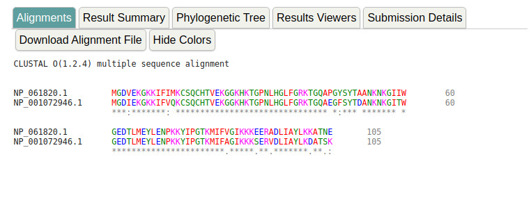

### 1.- Completar el cuadro:

| Secuencia      | Nombre taxonómico        | Nombre común        |
|----------------|--------------------------|---------------------|
| NP_061820.1    | Homo sapiens             | Humano              |
| NP_001072946.1 | Gallus gallus            | Gallina             |
| NP_001065289.1 | Pan troglodytes          | Chimancé común      |
| NP_001157486.1 | Equus caballus           | Caballo             |
| NP_001183974.1 | Canis lupus familiaris   | Lobo                |
| AEP27192.1     | Gorilla gorilla          | Gorila              |
| XP_024245566.1 | Oncorhynchus tshawytscha | Salmón real         |
| NP_001086101.1 | Xenopus laevis           | Conejo              |
| NP_477164.1    | Drosophila melanogaster  | Mosca de la fruta   |

### 2.-¿Cuán sencillo será alinear dos o más secuencias a mano? ¿Cuánto influirá en el número de secuencias a alinear, su longitud, y la similitud entre ellas?

Si son solo dos secuencias cortas se puede hacer a mano, si ya son mas, son largas o completamente distintas se vuelve casi imposible de hacer a mano.

### 3.-¿Son parecidos los citocromos c de humano y gallo?

Si son parecidas dado que la proteina es la encargada de la respiracion a niuvel celular.

### 4.-¿Qué teorías subyacen a este análisis?

Si son dos secuencias se puede usar Needleman / Wunsch que utiliza matrices de similitud para asignar puntos.

Si se comparan mas secuencias se utiliza programacion dinamica, como lo hace Clustal.

### 5.-¿Cómo nos ayuda la evolución a explicar sus similitudes y diferencias?

### 6.-Podemos elegir verlo en colores (Show Color ). ¿Qué indican los colores?

| Residue  | Colour  | Property                                     |
|----------|---------|----------------------------------------------|
| AVFPMILW | Red     | Small(small+ hydrophobic (incl.aromatic -Y)) |
| DE       | Blue    | Acidic                                       |
| RK       | Magenta | Basic - H                                    |
| STYHCNGQ | Green   | Hydroxyl + sulfhydryl + amine + G            |
| Others   | Grey    | Unusual amino/imino acids etc                |

### 7.-¿Qué indican el guión (-), los dos puntos (:) y el asterisco (*)?

El “-” significa un GAP, que es un corrimiento de la cadena que puede ser por una deleción o una adición.
El “*”  implica que el residuo analizado se conserva en la posición analizada.
El “:” implica que el residuo analizado en esa posición tiene una conservación fuerte.
El “.”  es una conservación débil.

### 8.- A simple vista, ¿se conserva la secuencia del citocromo c en los organismos?

### 9.- ¿Creeríamos que todos los organismos se asemejan por igual al resto, o se pueden identificar grupos de mayor similitud? Si es así, ¿tienen sentido? ¿Qué evidencias nos aportaría este análisis, a la luz de la evolución?

Hay grupos de mayor similitud.
El aporte que nos da la evolución es que las similitudes anatómicas y fisiológicas se ven reflejadas en el análisis de las secuencias.

### 10.- A juzgar por los organismos participantes, ¿cuáles creería que deberían estar más agrupados en el árbol filogenético?

Creeriamos que el Gorila, el chimpance y el humano.

### 11.- Observemos el árbol filogenético. ¿Concuerda con lo esperado? ¿De qué organismos son los citocromos c más parecidos? ¿Cómo se explica?